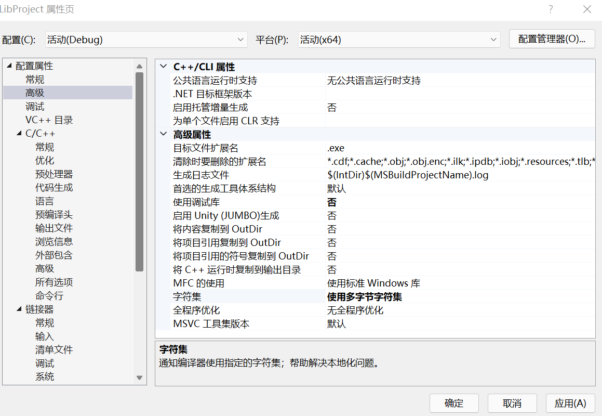

# 链接库随笔
[参考文献](https://blog.csdn.net/weixin_45004203/article/details/122906403)

## 主要内容如下
   +  链接库介绍和分类
   +  链接库的生成
   +  链接库的使用

## 链接库介绍与分类
       计算机中有些文件专门用于存储可重复使用的代码，例如函数或者类，通常将其称为库文件，也可以简称为库。所谓**链接库**就是将开源的库文件进行编译，打包后得到的二进制文件。链接库无法独立运行，必须让其他的程序加载才可以导入到内存中。

   ###   编译
       由编译器逐个对源文件进行语法，语义分析，最终生成目标文件，目标文件都是二进制文件，无法单独执行。他们会相互调用对方的函数或变量。也可能会调用某些链接库文件中的函数或变量。编译器无法跨文件的找到文件确切的存储地址。

   ###    链接
       对于各个目标文件中缺失的函数和变量的存储地址，由链接器负责处理，最终生成可执行文件（将所有的目标文件和链接库组织起来）。
 
   ###    链接库的分类
          链接库由两种，一种为静态链接 ，一种为动态链接
    
   ####  静态链接
          静态链接是指在编译过程中，无论缺失的地址位于其他目标文件或者链接库中，链接库都会逐个找到生成可执行文件，可以独立运行。

   ####  动态链接
          动态链接是指在编译过程中在所有目标文件中找到缺失的地址，生成可执行文件，仍缺失的部分，在文件执行时，由链接库和可执行文件一同载入内存，再有链接器完成后续地址修复工作。

   ####  静态链接库和动态链接库的优缺点
          
 ##### 使用静态链接库完成链接，会有以下缺点：

 +  文件体积大，使用静态链接后可执行文件中拷贝了所有可执行文件和静态链接库的指令和数据。
 +  当有多个程序共同链接一个静态库时无法共享指令与数据，浪费内存空间。
 +  更新不方便，当链接库的某个文件更新后，必须重新链接才能运行

  ##### 优点:

 +  程序性能高，当程序每次运行后，不需要重新链接。
           
  ##### 使用动态链接库完成链接，优点：

 +  文件体积小，动态链接库和可执行文件是分别载入内存的，体积相对较小。
 +  可以多个程序共享动态链接库的指令与数据，节省内存空间
 +  更新方便，运行时自动链接。

 ##### 缺点：

  +  运行时需重新链接，会使打开程序的时间变慢一些。

 ##### 总结：
       动态链接库运行时重新链接消耗的性能并不高，但获得的优势十分明显，相当值得。
           
  ### lib文件和dll文件
             当使用静态链接库时，编译完成后只会生成一个lib文件。
             当使用动态链接库时，编译完成后会生成一个lib文件和一个dll文件。
  
  #### lib文件
          
#####   在静态库和动态库链接时生成的lib文件内容并不相同。

 + 静态库：静态库生成的lib文件包含函数代码本身的定义以及实现。在编译时全部加入到程序中。
 + 动态库：动态库生成的lib文件只包含函数的索引以及dll文件的信息，具体函数实现由运行时dll文件加载入程序中。
 + 总结：lib文件在编译中使用，dll文件在运行中使用。如果只需要编译就只要lib文件就可以了，如果只是想让使用动态链接且已经编译完成的程序运行起来使用dll文件就可以了。  

 ## 链接库的生成
      
### 本文已VS22为例，演示如何生成静态库和动态库。
     
### 静态库lib文件的生成

  1.  创建一个新项目
	
   

   2.  分别添加一个头文件和一个源文件到项目中
   
   

   3.  右击项目，单击属性页面，在配置属性中找到常规选项卡，将配置类型改为**静态库(.lib)**
   
   

  4.  如果在编译时出现未定义的变量等问题，可尝试更改字符集为多字节字符集
   
   

  5.  开始正式编译，编译成功后会生成lib文件
   
   
    
  ### 动态库lib文件和dll文件的生成      
   
  
  ## 链接库的使用
                
 ### 静态链接库的使用

   1.   打开想要引用链接库的项目
   
   
      
   2.   打开项目的属性页面链接器常规选项卡，修改附加库目录为lib文件所在文件夹的目录
   
   
           
  3.   为了防止编译器识别不了lib文件，将lib文件名输入到下图所在位置
   
   

              
            
     

     